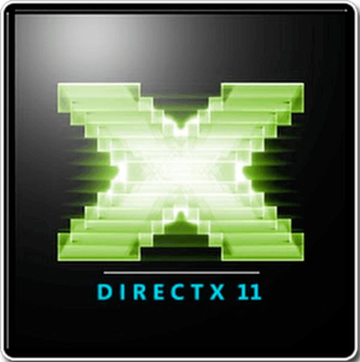

### Hey, nice to meet you I'm Joe 👋😊

## Little bit about me: 
- 💻 At heart I'm a C++ developer, but I work with C# and Javascript occasionally.
- 📚 I'm a final year student studying Game Engine Programming at Staffordshire University 
- 🧠 Always interested in learing new skills. Currently teaching myself electronics and embedded systems ⚡
- 🎯 Goals: 
    - Get a deeper fundamental understanding of C++ and look into the assembly language
    - Undertake more projects and populate my portfolio more
- 🕹 In my spare time I play video games or edit videos 🎬
 

## Languages and software:

 
 

## Connect with me:

[][twitter]
[][linkedin]
[][website]

[twitter]: https://twitter.com/JoeBevan_
[linkedin]: https://www.linkedin.com/in/joe-bevan-247764174/
[website]: https://joe-bevan.github.io/
